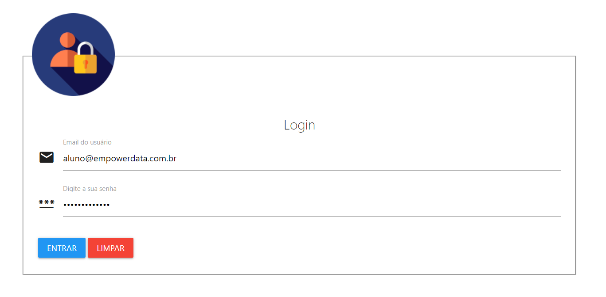
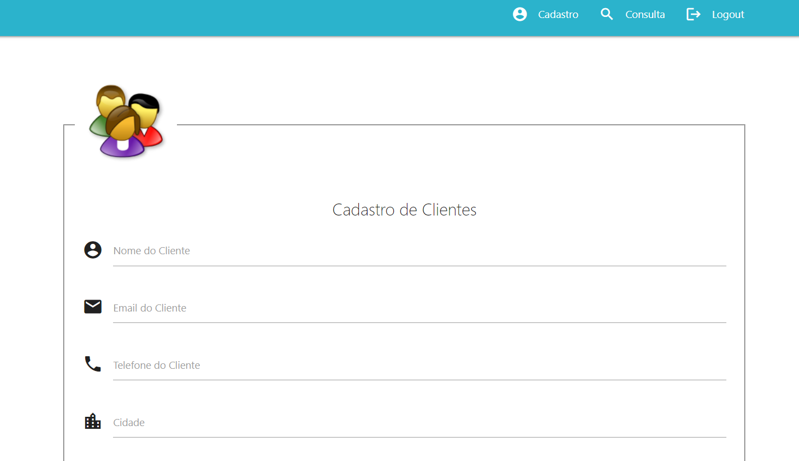
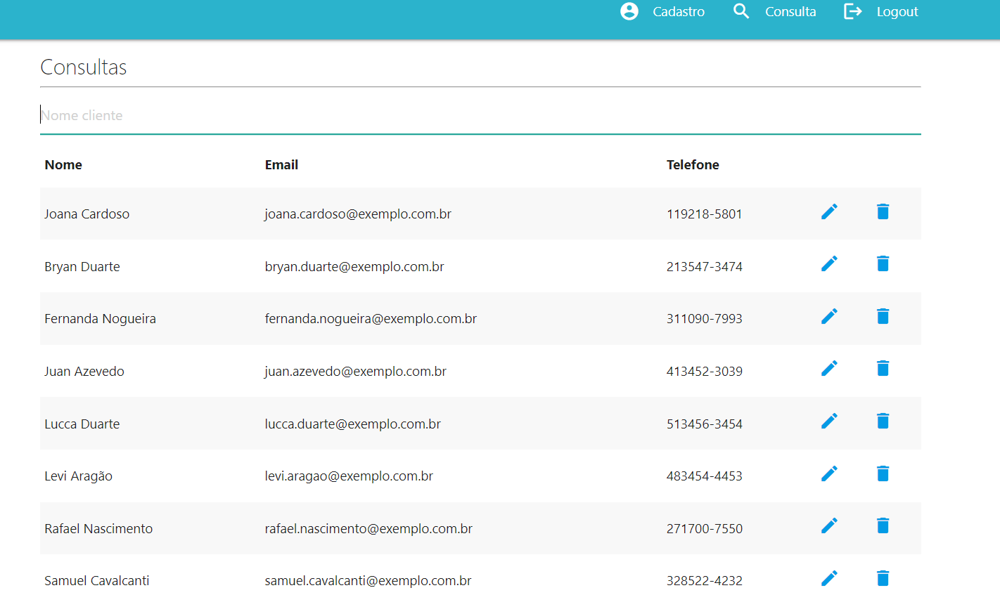

# 🤖Automatização de Cadastro - RPA

Descrição da funcionalidade do programa:

Lê um arquivo em Excel com cadastros de clientes e preenche e atualiza no sistema (site).

⚠️ Sem perder informações❗

💻 O programa só funciona no navegador Microsoft Edge, a versão que eu usei foi 116.0.1938.69.

Para a automatização do seu navegador você deve instalar o Webdrive na mesma pasta de executável Python.

Você pode baixar o Webdrive no site abaixo:

https://developer.microsoft.com/pt-br/microsoft-edge/tools/webdriver/

🧾Passos do programa:

- Ler o arquivo em Excel- Cadastro dos clientes.
- Abre o navegador insere o login e senha no sistema e inicializa o sistema.

  
- Depois ele insere os dados de cada cliente no sistema.

  
- Depois de inserir ele abre a aba consulta para verificação se todos os cadastros foram inseridos (30 segundos) e fecha o navegador.

  
- O programa também gera um arquivo de texto - log de erros indicando o motivo de algum cliente do arquivo Excel não ter sido cadastrado. ( Erros cobertos pelo programa - Campo maior que o tamanho permitido pelo sistema / formato de e-mail inválido(sem @)).
